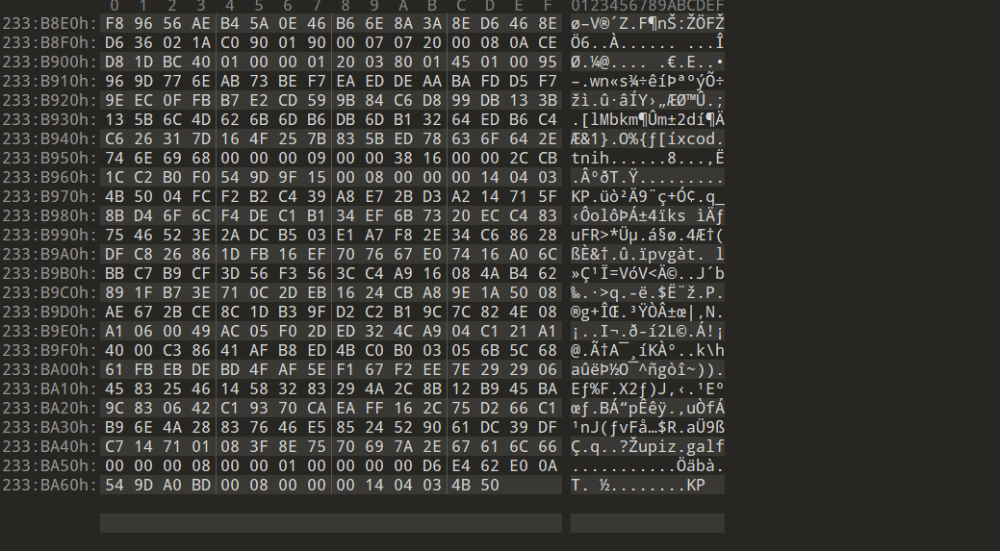

​	首先用010Editor打开，发现结尾有KP字样，结合之前讲课的文件结构知识，PK头代表zip文件，同时联想到文件名字是piz.noitseuq，倒置过来正好是question.zip，合理怀疑是压缩包文件被倒置。

​	简单写一个python脚本

```python
with open('piz.noitseuq','rb')as f1:
    with open('1.zip','wb')as f2:
        f2.write(f1.read()[::-1])
```

​	得到一个压缩包文件，没有密码直接解压

​	看到hint让听一听《secret player》，发现这个音频文件文件大小很异常，显然里面是存了信息的，用audacity导入，用频谱图显示，没看到什么信息，但是发现频谱图显示不完整，所以在频谱图设置里面将最低频率设置为16kHz，最高设置为20kHz。得到隐藏信息获得flag.zip的密码

​	使用密码解压即可