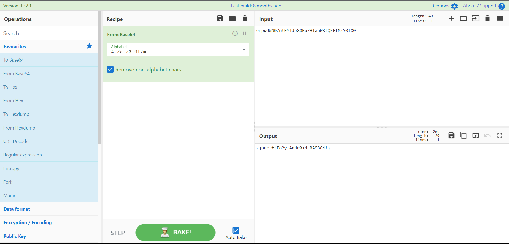

### Easybase

用Jadx-gui打开apk文件，查看MainActivity，可以看到如果check()返回值为true，则从strings里面提取一个id为base64的字符串并且解码之后放到Textview上面。

那么点击资源文件，找到/values/strings.xml，找到id为base64的string并且提取出来

找个网站解密base64即可

或者你也可以把check()函数的返回值用mt管理器修改，安装修改后的apk即可得到flag