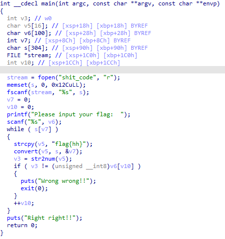
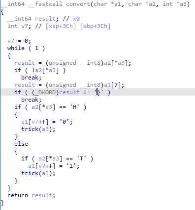
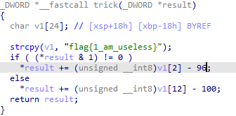
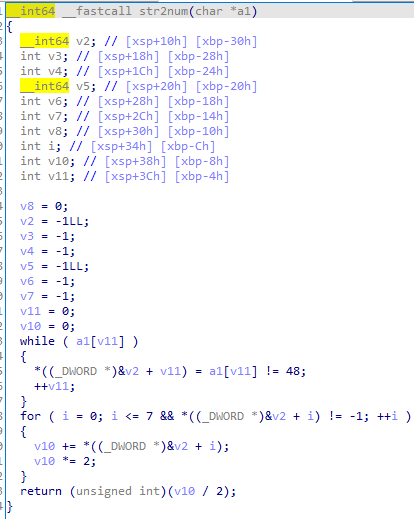

# shit_code

* 解压得到两个文件，一个是`shit code`，一个是可执行文件。将文件拖入ida64进行分析。
* 可以发现主函数中比较简单，将`shit_code`复制进入 s 中，同时将输入存入 v6 中。接下来看到自定义函数`convert`和`strnum`，这两个函数将 s 操作后存入了 v3 ，最后和输入进行对比，这应该就是我们要得到的 flag 了。



* 接下来先进入 `convert`进行分析，可以看到 a1 是`flag{hh}`字符串， a2 就是我们的`shit_code`，a3 是存储的下标。首先函数判断了当前下标的`shit_code`是否为空，接下来判断字符串结尾是否为 } （其实就是第八位修改就退出函数）。接下来就是重要的函数操作了，可以看到如果`shit_code`出现 H 就将数组的一位修改为 0 ，如果出现 T 就将数组的一位修改成 1 ，是从第一位开始修改的，修改到第八位就退出。接下来我们需要注意一下`hit_code`是怎么取出每一位的，其实就是看一下 a3 是怎么操作的，那就要进入`trick`。



* 仔细看 trick 发现是个 trick ，看着唬人，其实就是唬人的，它其实就是自加的操作。那么就可以知道 convert 就是遍历`shit_code`，将 H 转换为 0 ，T 转换为 1，并且是每八位一组的，其实也就能看出是8位二进制了。



* 接下来进入`str2num`函数，可以看出函数遍历了 a1 ，也就是上面`convert`函数出来的八位二进制，并将其与 0 对比后存入 v2 ，仔细看判断条件可以发现其实就是字符等于 0 就存 0 进入数组中，那实质就是将字符转化为整形。下面的操作比较明显就是二进制转十进制的位权相加。这样的话我们的思路就清晰了，把`shit_code`转化为二进制后再转十进制与你输入对比。



* 接下来就是脚本解密，其实都不能算逆向，可以算正向分析了。脚本如下：

```
p = open('shit_code','r')
temp = p.read()
flag = ''
enc = ''
for i in temp:
    #print(i)
    if i == 'H':
        enc += '0'
    if i == 'T':
        enc += '1'
    if len(enc) == 8:
        flag += chr(int(enc,2))
        enc = ''
print(flag)
```

