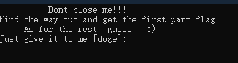
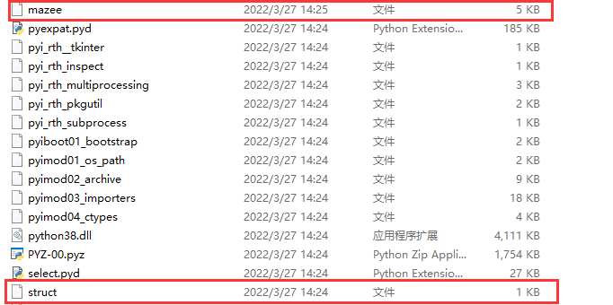
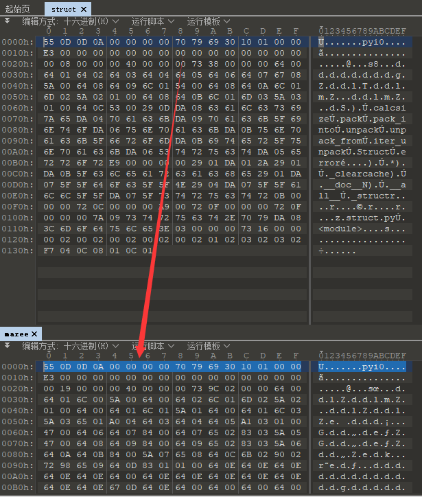
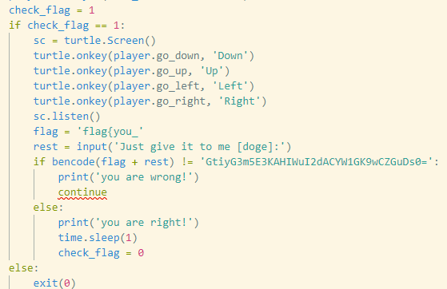
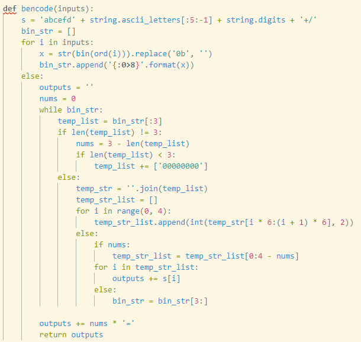

# Mapyze

* 根据提示可以知道玩过游戏可以给一部分 flag， 可得一部分 flag 为`flag{you_`，也可以直接跳过这个步骤。



* 我们可以看到这个可执行文件是由 Python 编写打包而成，我们自然而然可以想到要把它解压之后找到 pyc 文件进行逆向。我们使用`python3 pyinstxtractor.py mazee.exe`将文件解包，我们主要关注的是这两个文件。



* 接下来我们要做的就是把 mazee 文件中缺少的 python 版本等信息补上去，我们需要用到的是 010 editor ，之后将 mazee 添加 pyc 后缀。

  

* 接下来就是简单的 pyc 文件逆向，`uncompyle6 -o mazee.py mazee.pyc`，有一部分逆向不出，但不影响观看，主要部分是下面的部分，可以看到第一部分 flag 加上第二部分经过 bencode 加密的结果。

  

* 接下来阅读 bencode 函数内容，首先可以看到 s 是一个类似于 base64 的表，然后看下面的加密是分组 balabala ，仔细阅读就会发现这是一个 base64的加密，只不过不是原表。

  

* 接下来就是写个脚本解密一下就好了

  ```
  import base64
  import string
  
  enc = 'GtiyG3m5E3KAHIWuI2dACYW1GK9wCZGuDs0='
  s ='abcefd' + string.ascii_letters[:5:-1] + string.digits + '+/'
  
  string2 = "ABCDEFGHIJKLMNOPQRSTUVWXYZabcdefghijklmnopqrstuvwxyz0123456789+/"
  
  print(base64.b64decode(enc.translate(str.maketrans(s,string2))))
  ```

  
