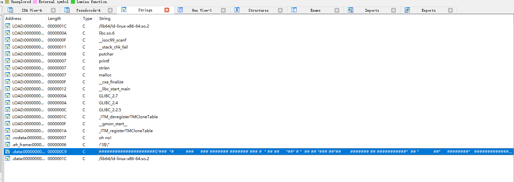
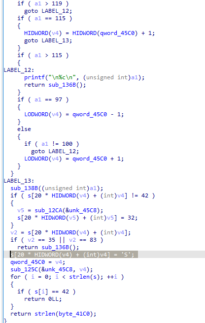
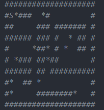

# this is a writeup
这道题是一个简单的re游戏
丢进ida，shift+F12就能找到地图

在sub_13BA里可以看到

在查找地图的时候，坐标为20*Y+X,可以看出为一行20个字符，因此可以分析出地图长这样：

由题意得这题是个贪吃蛇，直接走即可得到flag：
dsddddssaaaasawdddddssssaaawaasdddddwdddddddddsdddwaaaaaaaaawwwdwwwddddddddssssaaawwasawassddddddwwwwaaaaaaaasssasssaaawwwwwwdd