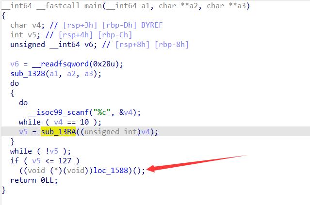
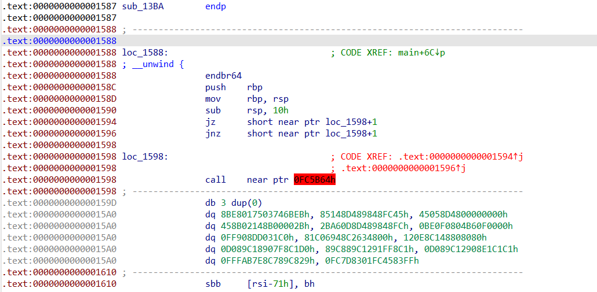
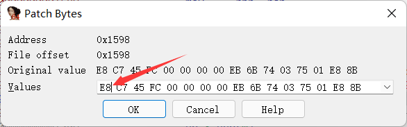
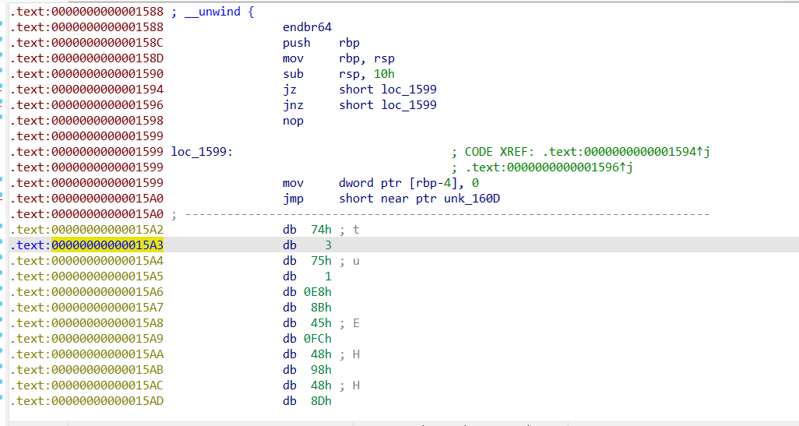
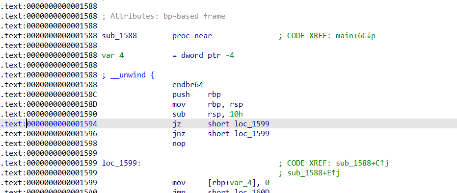
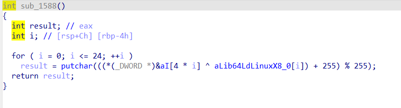
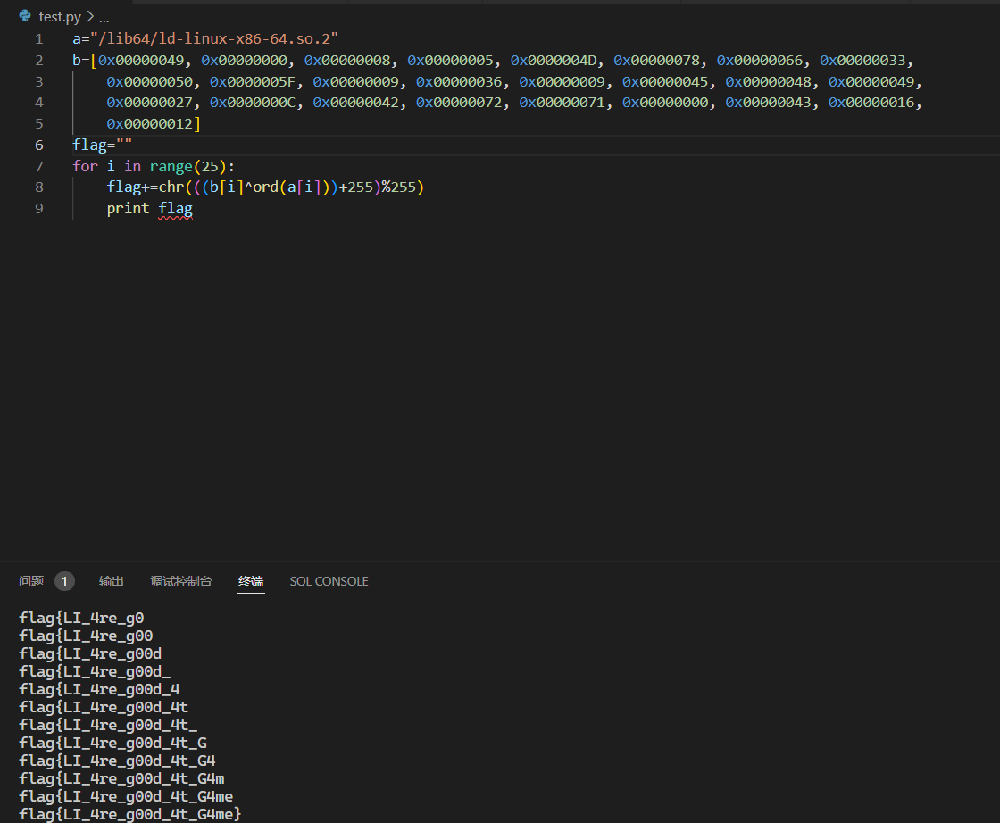

这个wp主要是讲一下花指令的去除，同样可以用来解这个题

拖进ida看main可以发现有一个神秘调用

双击过去发现反编译不了，直接一堆红色，观察汇编可以看到一个经典花指令jz jnz地址加一，花指令干扰了ida的识别。

只需要把001598这个位置的一个字节nop掉即可

选中loc_1598这一行 ida左上角Edit->PatchProgram->Patch Bytes 第一个字节改成90（即汇编的nop）

可以看到底下还是有一堆无法显示，在无法正常显示汇编的地方按一下c转换成code

还有一处相同的操作，同样处理掉即可

然后回到红色的最顶部，按u再按p即可恢复函数，可以看到已经恢复正常了。

这时候按f5可以看到逻辑

不难看出这个就是printflag的函数，直接提取数据出来打印flag即可。

by:Xunflash